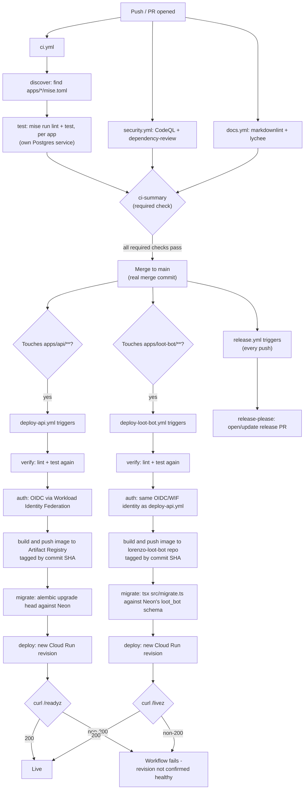

# CI/CD pipeline flowchart

Three independent triggers can fire off the same push to `main`: `release.yml` (always, proposing/updating a version bump), `deploy-api.yml` (only if the push touches `apps/api/**`), and `deploy-loot-bot.yml` (only if it touches `apps/loot-bot/**`, [ADR 0053](../../adr/0053-loot-bot-http-interactions-and-cloud-run-deploy.md)). None depend on each other — a release PR being merged doesn't itself deploy anything, and a deploy doesn't wait for a release to be tagged. `apps/inventory-web` and `apps/account-hub` have no equivalent job in this repo at all — Cloudflare Pages' own Git integration deploys them independently on the same push, outside GitHub Actions entirely (see [deployment.md](../deployment.md#appsinventory-web-and-appsaccount-hub)). See [docs/operations/releasing.md](../../operations/releasing.md) and [docs/architecture/deployment.md](../deployment.md).
