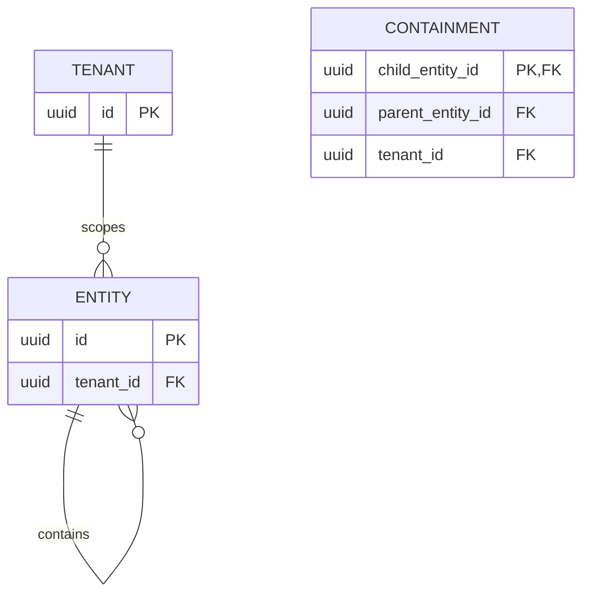

# ER diagram: containment (sub-slice 5)

The `ENTITY ||--o{ ENTITY : contains` self-relation is realized as `containment(child_entity_id, parent_entity_id)`, shown separately above since mermaid can't label a self-loop's own columns inline. Unlike [entity_prototype](entity-prototype-er.md), the PK is `child_entity_id` alone, not composite: a physical object has at most one direct container, so the cardinality is genuinely one parent to many children, not many-to-many. See [ADR 0016](../../adr/0016-containment.md): no row means "not contained in anything," and cycles are deliberately allowed - this proves the relation can be stored safely, nothing traverses it yet.
