# ER diagram: domain model

The merged, up-to-date picture of every table built so far: `feat/inventory-management` (sub-slices 1-7), `feat/auth-users` (auth/users/tenants/campaigns/players/GM, merged together - see ADR 0021+), the REST API surface built on top (ADR 0030-0049), and the tenant/user-management and notifications work since (profile pictures - ADR 0056, platform operations/activity log - ADR 0057/0063, notifications - ADR 0058-0061, campaign invite links - ADR 0092, the player-facing change feed - ADR 0099, editable information - ADR 0101, stat enum values and mandatory groups - ADR 0103, computed stats - ADR 0104). Each table's own ADR is the authoritative source for *why* it looks this way; this diagram just shows how they all connect. `created_at`/`updated_at` timestamps exist on every table except the pure join/extension tables (`entity_stat`, `entity_stat_group`, `entity_prototype`, `containment`, `item`, `item_instance`, `being`, `character`, `character_player`, `ownership`, `campaign_gm`, `tenant_admin_campaign_opt_out`, `group_member`, `user_profile_picture`, `tenant_profile_picture`, `campaign_profile_picture`) and are omitted below - they're uniform across the schema and would only add repetition, not information. `audit_log` and `notification` are the one exception worth calling out explicitly: both are append-only logs, so they carry `created_at` but deliberately no `updated_at` - a row is never mutated after creation. `created_by`/`updated_by` (nullable `FK -> app_user.id`, `ON DELETE SET NULL` - [ADR 0029](../../adr/0029-attribution-created-by-updated-by.md)) are omitted the same way, for a different reason: they're deliberately *not* uniform (which tables get the full pair, `created_by` only, or neither is itself a real decision, see ADR 0029's own table), and deliberately have no `relationship()` in code for mermaid to draw as a line - both by design, not by omission here. The `v_item`/`v_item_instance` views aren't drawn - each is derived (a `SELECT` over `entity`/`information`/`entity_stat`/`containment`, filtered to `item` or `item_instance` respectively), not its own stored relation - see [ADR 0019](../../adr/0019-item-and-v-item.md).

```mermaid
erDiagram
    APP_USER ||--o{ MEMBERSHIP : holds
    APP_USER ||--o{ PLAYER : holds
    APP_USER |o--o{ APP_USER : suspends
    TENANT ||--o{ MEMBERSHIP : scopes
    TENANT ||--o{ CAMPAIGN : scopes
    CAMPAIGN ||--o{ PLAYER : has
    CAMPAIGN ||--|| ENTITY : "has a dedicated"
    APP_USER }o--o{ CAMPAIGN : GMs
    APP_USER }o--o{ CAMPAIGN : "opts out of"
    TENANT ||--o{ ENTITY : scopes
    TENANT ||--o{ STAT_GROUP : scopes
    TENANT ||--o{ STAT_DEFINITION : scopes
    STAT_GROUP ||--o{ STAT_DEFINITION : clusters
    ENTITY }o--o{ STAT_GROUP : acquires
    ENTITY ||--o{ ENTITY_STAT : has
    STAT_DEFINITION ||--o{ ENTITY_STAT : "valued by"
    STAT_DEFINITION ||--o{ STAT_DEFINITION_ENUM_VALUE : allows
    ENTITY ||--o{ COMPUTED_STAT : "computes"
    STAT_DEFINITION ||--o{ COMPUTED_STAT : "computed by"
    COMPUTED_STAT ||--o| COMPUTED_STAT_LINEAR : "is a"
    COMPUTED_STAT ||--o| COMPUTED_STAT_COMPARISON : "is a"
    ENTITY }o--o{ ENTITY : "inherits from"
    ENTITY ||--o{ ENTITY : contains
    ENTITY ||--o{ INFORMATION : "described by"
    INFORMATION ||--o{ PAYLOAD : bundles
    PAYLOAD ||--o| PAYLOAD_DESCRIPTION : "is a"
    PAYLOAD ||--o| PAYLOAD_NUMBER : "is a"
    PAYLOAD ||--o| PAYLOAD_PICTURE : "is a"
    PAYLOAD ||--o| PAYLOAD_DOCUMENT : "is a"
    ENTITY ||--o| ITEM : "is a"
    ENTITY ||--o| ITEM_INSTANCE : "is a"
    ENTITY ||--o| BEING : "is a"
    BEING ||--o| CHARACTER : "is a"
    PLAYER o|--o{ CHARACTER : owns
    CHARACTER }o--o{ PLAYER : "piloted by"
    ENTITY ||--o{ ENTITY : owns
    ENTITY }o--o{ CHARACTER : groups
    ENTITY ||--o{ KNOWLEDGE : has
    PLAYER ||--o{ KNOWLEDGE : has
    INFORMATION ||--o{ KNOWLEDGE : has
    APP_USER ||--o{ NOTIFICATION : receives
    APP_USER ||--o{ NOTIFICATION : sends
    TENANT ||--o{ NOTIFICATION : scopes
    TENANT ||--o{ AUDIT_LOG : scopes
    APP_USER ||--o{ AUDIT_LOG : "acts as"
    APP_USER ||--o| USER_PROFILE_PICTURE : has
    TENANT ||--o| TENANT_PROFILE_PICTURE : has
    CAMPAIGN ||--o| CAMPAIGN_PROFILE_PICTURE : has
    USER_PROFILE_PICTURE ||--|| PROFILE_PICTURE : is
    TENANT_PROFILE_PICTURE ||--|| PROFILE_PICTURE : is
    CAMPAIGN_PROFILE_PICTURE ||--|| PROFILE_PICTURE : is
    CAMPAIGN ||--o{ CAMPAIGN_INVITE : "shared by"
    APP_USER ||--o{ CAMPAIGN_INVITE : creates
    TENANT ||--o{ ENTITY_CHANGE : scopes
    APP_USER ||--o{ ENTITY_CHANGE : receives

    APP_USER {
        uuid id PK
        string authgear_subject_id "globally unique, not per-tenant"
        string email "nullable, unique, synced from Authgear, never written otherwise"
        string nickname "nullable, unique, set by the user"
        string display_name "nullable, not unique"
        string pronouns "nullable"
        string bio "nullable"
        text_array locales "Postgres text[]"
        string user_color "nullable, hex colour"
        timestamptz suspended_at "nullable, set = rejected on every request"
        uuid suspended_by FK "nullable, ON DELETE SET NULL"
        string suspension_reason "nullable"
    }
    TENANT {
        uuid id PK
        string name
        string slug "globally unique, URL-safe"
        string description
    }
    MEMBERSHIP {
        uuid tenant_id PK,FK
        uuid user_id PK,FK
        enum role "owner | orga - tenant-wide access only"
    }
    CAMPAIGN {
        uuid id PK
        uuid tenant_id FK
        string name
        string game_system
        string slug "unique per tenant"
        string description
        boolean secret "default false; governs list filtering only"
        uuid entity_id FK "unique - a dedicated Entity for Information/Knowledge"
    }
    PLAYER {
        uuid id PK
        uuid user_id FK
        uuid campaign_id FK
        uuid tenant_id FK "denormalized copy of campaign.tenant_id"
    }
    ENTITY {
        uuid id PK
        uuid tenant_id FK
        string name "internal/reference name, not in-fiction text"
    }
    STAT_GROUP {
        uuid id PK
        uuid tenant_id FK
        string name
        int priority "inheritance tie-break"
        boolean mandatory "display-only; nothing enforces it"
    }
    STAT_DEFINITION {
        uuid id PK
        uuid tenant_id FK
        uuid stat_group_id FK
        string name
        enum value_type "int | text | float | bool | enum"
    }
    COMPUTED_STAT {
        uuid entity_id PK,FK
        uuid stat_definition_id PK,FK
        uuid tenant_id FK
    }
    COMPUTED_STAT_LINEAR {
        uuid entity_id PK,FK
        uuid stat_definition_id PK,FK
        uuid tenant_id FK
        uuid source_stat_definition_id FK
        numeric multiplier
        numeric offset
        text round_mode "none | floor | ceil | round | truncate"
    }
    COMPUTED_STAT_COMPARISON {
        uuid entity_id PK,FK
        uuid stat_definition_id PK,FK
        uuid tenant_id FK
        uuid left_stat_definition_id FK
        text comparator "lt | le | eq | ne | ge | gt"
        uuid right_stat_definition_id FK "exactly one of this or right_constant"
        numeric right_constant
        text true_value "text/enum targets only"
        text false_value "text/enum targets only"
    }
    STAT_DEFINITION_ENUM_VALUE {
        uuid id PK
        uuid tenant_id FK
        uuid stat_definition_id FK
        text value "unique per stat_definition"
        int sort_order "display hint, not unique"
    }
    ENTITY_STAT {
        uuid entity_id PK,FK
        uuid stat_definition_id PK,FK
        uuid tenant_id FK
        int value_int "exactly one of these four set"
        string value_text
        float value_float
        boolean value_bool
    }
    ENTITY_PROTOTYPE {
        uuid entity_id PK,FK
        uuid prototype_id PK,FK
        uuid tenant_id FK
    }
    CONTAINMENT {
        uuid child_entity_id PK,FK
        uuid parent_entity_id FK
        uuid tenant_id FK
    }
    INFORMATION {
        uuid id PK
        uuid tenant_id FK
        uuid entity_id FK
        text title
        text type "free-form category; only singleton types are unique per entity"
        boolean is_public "default false; false + no knowledge row = GM-only"
        int order "position per entity, unique; appended by trigger when omitted"
    }
    INFORMATION_TYPE {
        text name PK "global catalog, no tenant_id/RLS; read-only to the app"
        boolean is_singleton
        text category "technical | gm_authored"
    }
    PAYLOAD {
        uuid id PK
        uuid tenant_id FK
        uuid information_id FK
        int order "position per information, unique; appended by trigger when omitted"
    }
    PAYLOAD_DESCRIPTION {
        uuid payload_id PK,FK
        uuid tenant_id FK
        text locale
        text content
    }
    PAYLOAD_NUMBER {
        uuid payload_id PK,FK
        uuid tenant_id FK
        numeric value
    }
    PAYLOAD_PICTURE {
        uuid payload_id PK,FK
        uuid tenant_id FK
        bytea data
        text file_type
    }
    PAYLOAD_DOCUMENT {
        uuid payload_id PK,FK
        uuid tenant_id FK
        bytea data
        text filename
    }
    ITEM {
        uuid entity_id PK,FK
        uuid tenant_id FK
    }
    ITEM_INSTANCE {
        uuid entity_id PK,FK
        uuid tenant_id FK
    }
    BEING {
        uuid entity_id PK,FK
        uuid tenant_id FK
    }
    CHARACTER {
        uuid entity_id PK,FK
        uuid tenant_id FK
        uuid owner_player_id FK "nullable, ON DELETE SET NULL"
    }
    OWNERSHIP {
        uuid owned_entity_id PK,FK
        uuid owner_character_id FK "FK -> entity.id generically, not being.entity_id"
        uuid tenant_id FK
    }
    KNOWLEDGE {
        uuid id PK
        uuid tenant_id FK
        uuid knower_entity_id FK "nullable - character or group; exactly one of knower_entity_id/knower_player_id set"
        uuid knower_player_id FK "nullable - campaign-scoped player; exactly one of knower_entity_id/knower_player_id set"
        uuid information_id FK
    }
    NOTIFICATION {
        uuid id PK
        uuid batch_id "shared by every row one fan-out call creates"
        uuid user_id FK "recipient"
        uuid tenant_id FK "nullable - null for platform scope"
        string scope "platform | tenant | campaign | character | group, by convention"
        uuid source_id "nullable - campaign/character id, for deep-linking"
        string type "free-form, e.g. tenant_invite"
        string title
        string body
        datetime read_at "nullable"
        uuid created_by FK "nullable - sender"
    }
    AUDIT_LOG {
        uuid id PK
        uuid tenant_id FK "not nullable - platform-scope events out of scope for this slice"
        uuid actor_id FK "nullable, ON DELETE SET NULL"
        string action
        string target_type
        uuid target_id "nullable"
        string detail "nullable"
    }
    PROFILE_PICTURE {
        uuid id PK
        bytea data
        string file_type
    }
    USER_PROFILE_PICTURE {
        uuid user_id PK,FK
        uuid profile_picture_id FK "unique"
    }
    TENANT_PROFILE_PICTURE {
        uuid tenant_id PK,FK
        uuid profile_picture_id FK "unique"
    }
    CAMPAIGN_PROFILE_PICTURE {
        uuid campaign_id PK,FK
        uuid tenant_id FK "denormalized copy of campaign.tenant_id"
        uuid profile_picture_id FK "unique"
    }
    CAMPAIGN_INVITE {
        uuid id PK
        uuid tenant_id FK
        uuid campaign_id FK
        string token_hash "SHA-256 of the token, unique; the token itself is never stored"
        timestamptz expires_at "required"
        int max_uses "nullable = unlimited"
        int use_count
        timestamptz revoked_at "nullable"
    }
    ENTITY_CHANGE {
        uuid id PK "generated by the app, not the database"
        uuid tenant_id FK
        uuid user_id FK "the recipient"
        uuid character_entity_id "not a foreign key"
        uuid entity_id "not a foreign key, outlives a deleted item"
        string kind "received, given_away, moved, split, merged, renamed, deleted"
        string entity_name "copied in at write time"
        string detail "nullable, ids and counts only"
        uuid actor_user_id FK "nullable, ON DELETE SET NULL"
        boolean actor_visible "false for GMs and tenant administrators"
        timestamptz occurred_at "app-generated, 90-day retention"
    }
```

A few things this single view makes clearer than any one sub-slice's diagram could:

- **`ENTITY` carries two independent self-relations with opposite cycle policies**: `entity_prototype` (`}o--o{`, many-to-many, cycles rejected by a trigger - [ADR 0015](../../adr/0015-entity-prototype.md)) and `containment` (`||--o{`, one-to-many, cycles deliberately allowed - [ADR 0016](../../adr/0016-containment.md)). They look similar as plain FK pairs but mean opposite things.
- **`ENTITY }o--o{ STAT_GROUP : acquires`** is the one n:m relation realized as a pure join table (`entity_stat_group`) with no attributes of its own, so it isn't drawn as its own box here, unlike the two self-relations above (which need a box because mermaid can't label a self-loop's own columns inline).
- **Every table added after `entity` FKs back to it, directly or transitively** - `stat_group`/`stat_definition` are the only tenant-scoped tables that don't (they're independent top-level vocabulary, only linked to entities through `entity_stat_group`/`entity_stat`), which is why they get their own explicit `TENANT` relation above while everything else's tenant-scoping is implied through the chain back to `ENTITY`.
- `payload`'s four extensions (`is a`) are drawn identically to how `item`/`item_instance`/`being` extend `entity` here - the same class-table-inheritance shape, applied a third time (a `place` extension may still follow later).
- **`ownership` reuses `containment`'s exact self-loop shape**: `owned_entity_id` alone is the PK (at most one owner at a time, globally, just like at most one container), so it's drawn as a direct `ENTITY ||--o{ ENTITY : owns` self-loop rather than routing through its own box - `owner_character_id` is deliberately a plain `FK -> entity.id`, not `being.entity_id`, so the schema doesn't rule out a non-character owner later ([ADR 0025](../../adr/0025-character-being-and-ownership.md)).
- **`character` is layered under `being`, not a sibling extending `entity`** ([ADR 0031](../../adr/0031-character-table-and-read-api.md)) - `entity_id` is PK *and* FK to `being.entity_id`, the first three-level class-table-inheritance chain here (`entity` -> `being` -> `character`), drawn as `BEING ||--o| CHARACTER : "is a"` rather than off `ENTITY` directly. A bare `being` with no `character` row is still valid - an untracked NPC/monster stub.
- `character.owner_player_id` ("who primarily owns this character," nullable, `ON DELETE SET NULL`, moved here from `being` by ADR 0031) and `character_player` ("which player rows can currently pilot it," genuinely n:m, retargeted from `being.entity_id` to `character.entity_id` by the same ADR) are deliberately two separate mechanisms, not one - RFC 0002 allows one player to control several characters at once and one character to be linked into several campaigns' player rows (roster reuse), so there's no single derivable "primary" owner to collapse them into. A `being` now has to be "promoted" to a `character` row before either can apply.
- `item_instance.owner_entity_id` used to be a column on `item_instance` itself (ADR 0019's placeholder, "until character exists"); it's now `v_item_instance`'s own derived column, sourced from a join against `ownership` - same name, position, and type in the view's output, so nothing downstream of the view noticed the change ([ADR 0025](../../adr/0025-character-being-and-ownership.md)).
- **`campaign_gm` and `tenant_admin_campaign_opt_out` are two separate n:m joins between the same two entities**, `APP_USER` and `CAMPAIGN` - like `entity_stat_group`, both are pure existence joins with no attribute beyond their own FKs/`tenant_id`, so neither gets its own box; unlike `entity_stat_group`, there are two of them here rather than one, since GMing a campaign and opting out of a campaign are independent facts about the same pair ([ADR 0026](../../adr/0026-campaign-gm-orga-and-access-rule.md)). Renamed from `orga_campaign_opt_out` ([ADR 0030](../../adr/0030-tenant-campaign-read-api.md)): the opt-out now applies to either tenant-admin role (`OWNER` or `ORGA`), not `ORGA` alone. Not drawn: `campaign_gm`/`player` aren't mutually exclusive for the same user+campaign - a user can hold both at once.
- **`campaign`'s dedicated `entity_id`** ([ADR 0030](../../adr/0030-tenant-campaign-read-api.md)) is a plain reference column, not class-table inheritance the way `item`/`item_instance`/`being` extend `entity` - `campaign` keeps its own surrogate `id`, so this is drawn as an ordinary `||--||` line rather than an `"is a"` label. Exists so a campaign can carry `Information`/`Knowledge` (GM notes, images) the same generic way any other entity does; not exposed over REST yet.
- **`information.is_public` plus `knowledge` complete RFC 0001's four knower cases** ([ADR 0028](../../adr/0028-knowledge-and-group-membership.md)): character or group (`knowledge.knower_entity_id`), player (`knowledge.knower_player_id`), everyone (`is_public = true`, no `knowledge` row needed), or GM-only (the absence of both, the default). `group_member` reuses `character_player`'s bipartite shape (`group_entity_id -> entity.id`, `character_entity_id -> character.entity_id`, retargeted from `being.entity_id` by [ADR 0031](../../adr/0031-character-table-and-read-api.md)) - drawn as a plain `ENTITY }o--o{ CHARACTER` line, not a self-loop, and needs no box of its own for the same reason `entity_stat_group` doesn't.
- **`information_type` is the one table with no `tenant_id` and no RLS on purpose** ([ADR 0101](../../adr/0101-editable-information-and-description-payloads.md)): a global catalog of the few `information.type` values the application treats specially, written only by migrations (the app role can read it, not write it). It's drawn unconnected: `information.type` isn't a foreign key to it, since free-form types a GM invents have no row. Its `is_singleton` rows are mirrored by hand in the partial unique index `information_singleton_type`, which can't read another table.
- **`computed_stat` extends a stat's address, not an entity** ([ADR 0104](../../adr/0104-computed-stats.md)): it shares `entity_stat`'s `(entity_id, stat_definition_id)` key, and its two kinds extend it the way `payload`'s kinds extend `payload`. The source/left/right stat references (not drawn, to keep the diagram readable) point back at `stat_definition` without cascading, so a stat a formula reads can't disappear under it. `v_effective_stat` weighs `computed_stat` rows against `entity_stat` rows at every prototype hop; the formula itself is evaluated in Python.
- **`knowledge` is the one join table that needed a surrogate `id` and two explicit `UNIQUE` constraints** rather than relying on a composite PK - its two knower columns are mutually exclusive and always one-null (`CHECK(num_nonnulls(...) = 1)`, same shape as `entity_stat`'s four value columns), and Postgres can't put a nullable column in a composite PK at all.
- **`campaign_invite` is the one table readable by holding a secret rather than being someone** ([ADR 0092](../../adr/0092-campaign-invite-links.md)): besides the ordinary tenant policy it has a select-only policy keyed on `app.invite_token_hash`, which only the two public `/invites/{token}` routes set - a token holder can read that one row and nothing else, and can write nothing. Redeeming creates an ordinary `player` row; there is no separate "redemption" table, only `use_count` and an `audit_log` entry.
- **`entity_change` is readable only by its recipient** ([ADR 0099](../../adr/0099-player-facing-change-feed.md)) - stricter than `notification`, which also admits anyone holding the tenant context. Rows are written by whoever made the change, inside that route's tenant context, so the app generates `id` and `occurred_at` itself: with nothing server-generated there is no `INSERT ... RETURNING` that the recipient-only read policy would reject. `entity_id` and `character_entity_id` are deliberately not foreign keys, so a `deleted` row outlives its item; like `audit_log`, a row is never updated after it is written.

Not shown: the partial `UNIQUE(entity_id, type) WHERE type IN ('description', 'main_picture')` on `information` plus `UNIQUE(entity_id, order)` on it and `UNIQUE(information_id, order)` on `payload` ([ADR 0101](../../adr/0101-editable-information-and-description-payloads.md)), `UNIQUE(tenant_id, name)` on `stat_group`/`stat_definition`, `UNIQUE(authgear_subject_id)`, `UNIQUE(email)` and `UNIQUE(nickname)` on `app_user`, `UNIQUE(campaign_id, user_id)` on `player`, `UNIQUE(tenant_id, slug)` on `campaign`, `UNIQUE` (global) on `tenant.slug` and `campaign_invite.token_hash`, and on `knowledge`, `UNIQUE(knower_entity_id, information_id)`/`UNIQUE(knower_player_id, information_id)` - mermaid's ER notation has no marker for a composite/plain unique constraint distinct from the relationship lines above, and nothing here can draw `item_instance`'s unenforced "must have an item-typed direct prototype" invariant either, since it isn't a real constraint. See each table's ADR for the full constraint list ([0012](../../adr/0012-entity-table.md) entity, [0013](../../adr/0013-tenant-table-bootstrap.md) tenant, [0014](../../adr/0014-stats.md) stats, [0015](../../adr/0015-entity-prototype.md) entity_prototype, [0016](../../adr/0016-containment.md) containment, [0017](../../adr/0017-information-and-payloads.md) information/payload, [0019](../../adr/0019-item-and-v-item.md) item/item_instance/v_item, [0022](../../adr/0022-user-tenant-membership.md) app_user/tenant/membership, [0054](../../adr/0054-user-identity-email-and-nickname.md) app_user email/nickname, [0057](../../adr/0057-platform-operations.md) app_user suspension, [0060](../../adr/0060-user-profile-expansion.md) app_user profile, [0024](../../adr/0024-campaign-and-player.md)/[0030](../../adr/0030-tenant-campaign-read-api.md) campaign/player, [0025](../../adr/0025-character-being-and-ownership.md)/[0031](../../adr/0031-character-table-and-read-api.md) being/character/character_player/ownership, [0026](../../adr/0026-campaign-gm-orga-and-access-rule.md)/[0030](../../adr/0030-tenant-campaign-read-api.md) campaign_gm/tenant_admin_campaign_opt_out, [0028](../../adr/0028-knowledge-and-group-membership.md)/[0031](../../adr/0031-character-table-and-read-api.md) knowledge/group_member/information.is_public, [0029](../../adr/0029-attribution-created-by-updated-by.md) created_by/updated_by, [0056](../../adr/0056-profile-pictures.md) profile_picture/user_profile_picture/tenant_profile_picture/campaign_profile_picture, [0057](../../adr/0057-platform-operations.md)/[0063](../../adr/0063-tenant-activity-log.md) audit_log, [0058](../../adr/0058-notifications.md)-[0061](../../adr/0061-notification-sender-read-receipts.md) notification, [0092](../../adr/0092-campaign-invite-links.md) campaign_invite, [0099](../../adr/0099-player-facing-change-feed.md) entity_change.
