# ER diagram: domain model

The merged, up-to-date picture of every table built so far across `feat/inventory-management` (sub-slices 1-7) and `feat/auth-users` (auth/users/tenants/campaigns/players/GM, merged together - see ADR 0021+). Each table's own ADR is the authoritative source for *why* it looks this way; this diagram just shows how they all connect. `created_at`/`updated_at` timestamps exist on every table except the pure join/extension tables (`entity_stat`, `entity_stat_group`, `entity_prototype`, `containment`, `item`, `item_instance`, `being`, `character_player`, `ownership`, `campaign_gm`, `orga_campaign_opt_out`, `group_member`) and are omitted below - they're uniform across the schema and would only add repetition, not information. The `v_item`/`v_item_instance` views aren't drawn - each is derived (a `SELECT` over `entity`/`information`/`entity_stat`/`containment`, filtered to `item` or `item_instance` respectively), not its own stored relation - see [ADR 0019](../../adr/0019-item-and-v-item.md).

```mermaid
erDiagram
    APP_USER ||--o{ MEMBERSHIP : holds
    APP_USER ||--o{ PLAYER : holds
    TENANT ||--o{ MEMBERSHIP : scopes
    TENANT ||--o{ CAMPAIGN : scopes
    CAMPAIGN ||--o{ PLAYER : has
    APP_USER }o--o{ CAMPAIGN : GMs
    APP_USER }o--o{ CAMPAIGN : "opts out of"
    TENANT ||--o{ ENTITY : scopes
    TENANT ||--o{ STAT_GROUP : scopes
    TENANT ||--o{ STAT_DEFINITION : scopes
    STAT_GROUP ||--o{ STAT_DEFINITION : clusters
    ENTITY }o--o{ STAT_GROUP : acquires
    ENTITY ||--o{ ENTITY_STAT : has
    STAT_DEFINITION ||--o{ ENTITY_STAT : "valued by"
    ENTITY }o--o{ ENTITY : "inherits from"
    ENTITY ||--o{ ENTITY : contains
    ENTITY ||--o{ INFORMATION : "described by"
    INFORMATION ||--o{ PAYLOAD : bundles
    PAYLOAD ||--o| PAYLOAD_DESCRIPTION : "is a"
    PAYLOAD ||--o| PAYLOAD_NUMBER : "is a"
    PAYLOAD ||--o| PAYLOAD_PICTURE : "is a"
    PAYLOAD ||--o| PAYLOAD_DOCUMENT : "is a"
    ENTITY ||--o| ITEM : "is a"
    ENTITY ||--o| ITEM_INSTANCE : "is a"
    ENTITY ||--o| BEING : "is a"
    PLAYER o|--o{ BEING : owns
    BEING }o--o{ PLAYER : "piloted by"
    ENTITY ||--o{ ENTITY : owns
    ENTITY }o--o{ BEING : groups
    ENTITY ||--o{ KNOWLEDGE : has
    PLAYER ||--o{ KNOWLEDGE : has
    INFORMATION ||--o{ KNOWLEDGE : has

    APP_USER {
        uuid id PK
        string authgear_subject_id "globally unique, not per-tenant"
    }
    TENANT {
        uuid id PK
        string name
    }
    MEMBERSHIP {
        uuid tenant_id PK,FK
        uuid user_id PK,FK
        enum role "owner | orga - tenant-wide access only"
    }
    CAMPAIGN {
        uuid id PK
        uuid tenant_id FK
        string name
        string game_system
    }
    PLAYER {
        uuid id PK
        uuid user_id FK
        uuid campaign_id FK
        uuid tenant_id FK "denormalized copy of campaign.tenant_id"
    }
    ENTITY {
        uuid id PK
        uuid tenant_id FK
        string name "internal/reference name, not in-fiction text"
    }
    STAT_GROUP {
        uuid id PK
        uuid tenant_id FK
        string name
        int priority "inheritance tie-break"
    }
    STAT_DEFINITION {
        uuid id PK
        uuid tenant_id FK
        uuid stat_group_id FK
        string name
        enum value_type "int | text | float | bool"
    }
    ENTITY_STAT {
        uuid entity_id PK,FK
        uuid stat_definition_id PK,FK
        uuid tenant_id FK
        int value_int "exactly one of these four set"
        string value_text
        float value_float
        boolean value_bool
    }
    ENTITY_PROTOTYPE {
        uuid entity_id PK,FK
        uuid prototype_id PK,FK
        uuid tenant_id FK
    }
    CONTAINMENT {
        uuid child_entity_id PK,FK
        uuid parent_entity_id FK
        uuid tenant_id FK
    }
    INFORMATION {
        uuid id PK
        uuid tenant_id FK
        uuid entity_id FK
        text title
        text type "free-form category, unique per entity"
        boolean is_public "default false; false + no knowledge row = GM-only"
    }
    PAYLOAD {
        uuid id PK
        uuid tenant_id FK
        uuid information_id FK
    }
    PAYLOAD_DESCRIPTION {
        uuid payload_id PK,FK
        uuid tenant_id FK
        text locale
        text content
    }
    PAYLOAD_NUMBER {
        uuid payload_id PK,FK
        uuid tenant_id FK
        numeric value
    }
    PAYLOAD_PICTURE {
        uuid payload_id PK,FK
        uuid tenant_id FK
        bytea data
        text file_type
    }
    PAYLOAD_DOCUMENT {
        uuid payload_id PK,FK
        uuid tenant_id FK
        bytea data
        text filename
    }
    ITEM {
        uuid entity_id PK,FK
        uuid tenant_id FK
    }
    ITEM_INSTANCE {
        uuid entity_id PK,FK
        uuid tenant_id FK
    }
    BEING {
        uuid entity_id PK,FK
        uuid owner_player_id FK "nullable, ON DELETE SET NULL"
        uuid tenant_id FK
    }
    OWNERSHIP {
        uuid owned_entity_id PK,FK
        uuid owner_character_id FK "FK -> entity.id generically, not being.entity_id"
        uuid tenant_id FK
    }
    KNOWLEDGE {
        uuid id PK
        uuid tenant_id FK
        uuid knower_entity_id FK "nullable - character or group; exactly one of knower_entity_id/knower_player_id set"
        uuid knower_player_id FK "nullable - campaign-scoped player; exactly one of knower_entity_id/knower_player_id set"
        uuid information_id FK
    }
```

A few things this single view makes clearer than any one sub-slice's diagram could:

- **`ENTITY` carries two independent self-relations with opposite cycle policies**: `entity_prototype` (`}o--o{`, many-to-many, cycles rejected by a trigger - [ADR 0015](../../adr/0015-entity-prototype.md)) and `containment` (`||--o{`, one-to-many, cycles deliberately allowed - [ADR 0016](../../adr/0016-containment.md)). They look similar as plain FK pairs but mean opposite things.
- **`ENTITY }o--o{ STAT_GROUP : acquires`** is the one n:m relation realized as a pure join table (`entity_stat_group`) with no attributes of its own, so it isn't drawn as its own box here, unlike the two self-relations above (which need a box because mermaid can't label a self-loop's own columns inline).
- **Every table added after `entity` FKs back to it, directly or transitively** - `stat_group`/`stat_definition` are the only tenant-scoped tables that don't (they're independent top-level vocabulary, only linked to entities through `entity_stat_group`/`entity_stat`), which is why they get their own explicit `TENANT` relation above while everything else's tenant-scoping is implied through the chain back to `ENTITY`.
- `payload`'s four extensions (`is a`) are drawn identically to how `item`/`item_instance`/`being` extend `entity` here - the same class-table-inheritance shape, applied a third time (a `place` extension may still follow later).
- **`ownership` reuses `containment`'s exact self-loop shape**: `owned_entity_id` alone is the PK (at most one owner at a time, globally, just like at most one container), so it's drawn as a direct `ENTITY ||--o{ ENTITY : owns` self-loop rather than routing through its own box - `owner_character_id` is deliberately a plain `FK -> entity.id`, not `being.entity_id`, so the schema doesn't rule out a non-character owner later ([ADR 0025](../../adr/0025-character-being-and-ownership.md)).
- `being.owner_player_id` ("who primarily owns this character," nullable, `ON DELETE SET NULL`) and `character_player` ("which player rows can currently pilot it," genuinely n:m) are deliberately two separate mechanisms, not one - RFC 0002 allows one player to control several characters at once and one character to be linked into several campaigns' player rows (roster reuse), so there's no single derivable "primary" owner to collapse them into.
- `item_instance.owner_entity_id` used to be a column on `item_instance` itself (ADR 0019's placeholder, "until character exists"); it's now `v_item_instance`'s own derived column, sourced from a join against `ownership` - same name, position, and type in the view's output, so nothing downstream of the view noticed the change ([ADR 0025](../../adr/0025-character-being-and-ownership.md)).
- **`campaign_gm` and `orga_campaign_opt_out` are two separate n:m joins between the same two entities**, `APP_USER` and `CAMPAIGN` - like `entity_stat_group`, both are pure existence joins with no attribute beyond their own FKs/`tenant_id`, so neither gets its own box; unlike `entity_stat_group`, there are two of them here rather than one, since GMing a campaign and opting out of a campaign are independent facts about the same pair ([ADR 0026](../../adr/0026-campaign-gm-orga-and-access-rule.md)). Not drawn: `campaign_gm`/`player` aren't mutually exclusive for the same user+campaign - a user can hold both at once.
- **`information.is_public` plus `knowledge` complete RFC 0001's four knower cases** ([ADR 0028](../../adr/0028-knowledge-and-group-membership.md)): character or group (`knowledge.knower_entity_id`), player (`knowledge.knower_player_id`), everyone (`is_public = true`, no `knowledge` row needed), or GM-only (the absence of both, the default). `group_member` reuses `character_player`'s bipartite shape (`group_entity_id -> entity.id`, `character_entity_id -> being.entity_id`) - drawn as a plain `ENTITY }o--o{ BEING` line, not a self-loop, and needs no box of its own for the same reason `entity_stat_group` doesn't.
- **`knowledge` is the one join table that needed a surrogate `id` and two explicit `UNIQUE` constraints** rather than relying on a composite PK - its two knower columns are mutually exclusive and always one-null (`CHECK(num_nonnulls(...) = 1)`, same shape as `entity_stat`'s four value columns), and Postgres can't put a nullable column in a composite PK at all.

Not shown: `UNIQUE(entity_id, type)` on `information`, `UNIQUE(tenant_id, name)` on `stat_group`/`stat_definition`, `UNIQUE(authgear_subject_id)` on `app_user`, `UNIQUE(campaign_id, user_id)` on `player`, and on `knowledge`, `UNIQUE(knower_entity_id, information_id)`/`UNIQUE(knower_player_id, information_id)` - mermaid's ER notation has no marker for a composite/plain unique constraint distinct from the relationship lines above, and nothing here can draw `item_instance`'s unenforced "must have an item-typed direct prototype" invariant either, since it isn't a real constraint. See each table's ADR for the full constraint list ([0012](../../adr/0012-entity-table.md) entity, [0013](../../adr/0013-tenant-table-bootstrap.md) tenant, [0014](../../adr/0014-stats.md) stats, [0015](../../adr/0015-entity-prototype.md) entity_prototype, [0016](../../adr/0016-containment.md) containment, [0017](../../adr/0017-information-and-payloads.md) information/payload, [0019](../../adr/0019-item-and-v-item.md) item/item_instance/v_item, [0022](../../adr/0022-user-tenant-membership.md) app_user/tenant/membership, [0024](../../adr/0024-campaign-and-player.md) campaign/player, [0025](../../adr/0025-character-being-and-ownership.md) being/character_player/ownership, [0026](../../adr/0026-campaign-gm-orga-and-access-rule.md) campaign_gm/orga_campaign_opt_out, [0028](../../adr/0028-knowledge-and-group-membership.md) knowledge/group_member/information.is_public).
