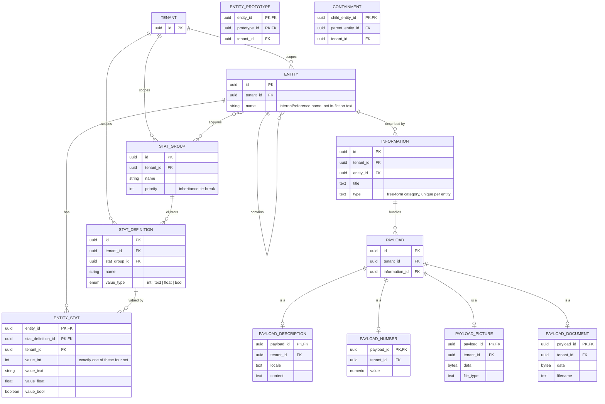

# ER diagram: domain model

The merged, up-to-date picture of every table built so far across sub-slices 1-6 on `feat/inventory-management`. Each table's own ADR is the authoritative source for *why* it looks this way; this diagram just shows how they all connect. `created_at`/`updated_at` timestamps exist on every table except the pure join tables (`entity_stat`, `entity_stat_group`, `entity_prototype`, `containment`) and are omitted below - they're uniform across the schema and would only add repetition, not information.

A few things this single view makes clearer than any one sub-slice's diagram could:

- **`ENTITY` carries two independent self-relations with opposite cycle policies**: `entity_prototype` (`}o--o{`, many-to-many, cycles rejected by a trigger - [ADR 0015](../../adr/0015-entity-prototype.md)) and `containment` (`||--o{`, one-to-many, cycles deliberately allowed - [ADR 0016](../../adr/0016-containment.md)). They look similar as plain FK pairs but mean opposite things.
- **`ENTITY }o--o{ STAT_GROUP : acquires`** is the one n:m relation realized as a pure join table (`entity_stat_group`) with no attributes of its own, so it isn't drawn as its own box here, unlike the two self-relations above (which need a box because mermaid can't label a self-loop's own columns inline).
- **Every table added after `entity` FKs back to it, directly or transitively** - `stat_group`/`stat_definition` are the only tenant-scoped tables that don't (they're independent top-level vocabulary, only linked to entities through `entity_stat_group`/`entity_stat`), which is why they get their own explicit `TENANT` relation above while everything else's tenant-scoping is implied through the chain back to `ENTITY`.
- `payload`'s four extensions (`is a`) are drawn identically to how `item`/`being`/`place` will eventually extend `entity` - the same class-table-inheritance shape, applied a second time.

Not shown: `UNIQUE(entity_id, type)` on `information` and `UNIQUE(tenant_id, name)` on `stat_group`/`stat_definition` - mermaid's ER notation has no marker for a composite unique constraint distinct from the relationship lines above. See each table's ADR for the full constraint list ([0012](../../adr/0012-entity-table.md) entity, [0013](../../adr/0013-tenant-table-bootstrap.md) tenant, [0014](../../adr/0014-stats.md) stats, [0015](../../adr/0015-entity-prototype.md) entity_prototype, [0016](../../adr/0016-containment.md) containment, [0017](../../adr/0017-information-and-payloads.md) information/payload).
