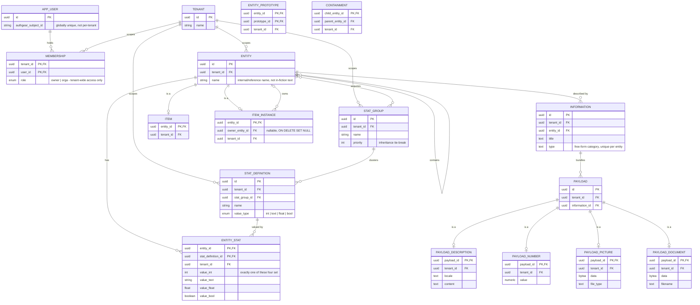

# ER diagram: domain model

The merged, up-to-date picture of every table built so far across `feat/inventory-management` (sub-slices 1-7) and `feat/auth-users` (auth/users/tenants/campaigns/players/GM, merged together - see ADR 0021+). Each table's own ADR is the authoritative source for *why* it looks this way; this diagram just shows how they all connect. `created_at`/`updated_at` timestamps exist on every table except the pure join/extension tables (`entity_stat`, `entity_stat_group`, `entity_prototype`, `containment`, `item`, `item_instance`) and are omitted below - they're uniform across the schema and would only add repetition, not information. The `v_item`/`v_item_instance` views aren't drawn - each is derived (a `SELECT` over `entity`/`information`/`entity_stat`/`containment`, filtered to `item` or `item_instance` respectively), not its own stored relation - see [ADR 0019](../../adr/0019-item-and-v-item.md).

A few things this single view makes clearer than any one sub-slice's diagram could:

- **`ENTITY` carries two independent self-relations with opposite cycle policies**: `entity_prototype` (`}o--o{`, many-to-many, cycles rejected by a trigger - [ADR 0015](../../adr/0015-entity-prototype.md)) and `containment` (`||--o{`, one-to-many, cycles deliberately allowed - [ADR 0016](../../adr/0016-containment.md)). They look similar as plain FK pairs but mean opposite things.
- **`ENTITY }o--o{ STAT_GROUP : acquires`** is the one n:m relation realized as a pure join table (`entity_stat_group`) with no attributes of its own, so it isn't drawn as its own box here, unlike the two self-relations above (which need a box because mermaid can't label a self-loop's own columns inline).
- **Every table added after `entity` FKs back to it, directly or transitively** - `stat_group`/`stat_definition` are the only tenant-scoped tables that don't (they're independent top-level vocabulary, only linked to entities through `entity_stat_group`/`entity_stat`), which is why they get their own explicit `TENANT` relation above while everything else's tenant-scoping is implied through the chain back to `ENTITY`.
- `payload`'s four extensions (`is a`) are drawn identically to how `item`/`item_instance` extend `entity` here, and how `being`/`place` will too - the same class-table-inheritance shape, applied a third time.
- `item_instance` has two independent relations to `ENTITY`: `is a` (its own identity, PK+FK, `ON DELETE CASCADE`) and `owns` (`owner_entity_id`, nullable, `ON DELETE SET NULL`) - deleting the instance's own entity removes it; deleting its owner's entity just leaves it ownerless. Different FK, different delete behavior, same target table.

Not shown: `UNIQUE(entity_id, type)` on `information`, `UNIQUE(tenant_id, name)` on `stat_group`/`stat_definition`, and `UNIQUE(authgear_subject_id)` on `app_user` - mermaid's ER notation has no marker for a composite/plain unique constraint distinct from the relationship lines above, and nothing here can draw `item_instance`'s unenforced "must have an item-typed direct prototype" invariant either, since it isn't a real constraint. See each table's ADR for the full constraint list ([0012](../../adr/0012-entity-table.md) entity, [0013](../../adr/0013-tenant-table-bootstrap.md) tenant, [0014](../../adr/0014-stats.md) stats, [0015](../../adr/0015-entity-prototype.md) entity_prototype, [0016](../../adr/0016-containment.md) containment, [0017](../../adr/0017-information-and-payloads.md) information/payload, [0019](../../adr/0019-item-and-v-item.md) item/item_instance/v_item, [0022](../../adr/0022-user-tenant-membership.md) app_user/tenant/membership).
