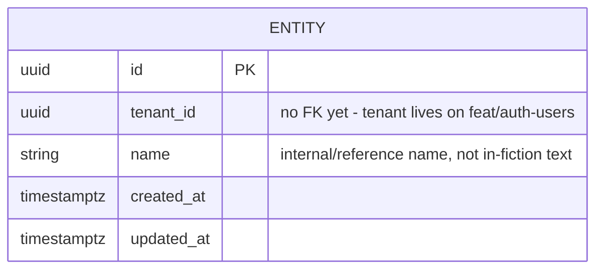

# ER diagram: entity (sub-slice 1)

Deliberately just one table — concrete types (`item`, `being`, `place`), prototypes, stats, information/knowledge, and containment each get their own sub-slice and their own diagram update, per [ADR 0012](../../adr/0012-entity-table.md).
