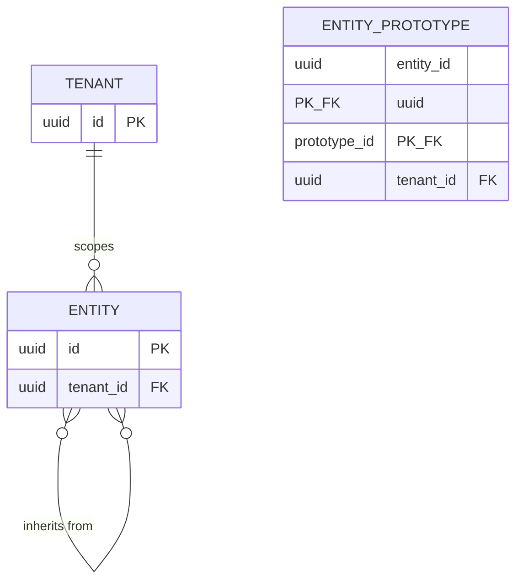

# ER diagram: entity_prototype (sub-slice 4)

The `ENTITY }o--o{ ENTITY` self-relation is realized as `entity_prototype(entity_id, prototype_id)`, shown separately above since mermaid can't label a self-loop's own columns inline. No resolution/inheritance-walk yet — see [ADR 0015](../../adr/0015-entity-prototype.md): this proves the graph can be built safely (multiple inheritance, cycle-rejected), not that anything reads effective stats through it.
