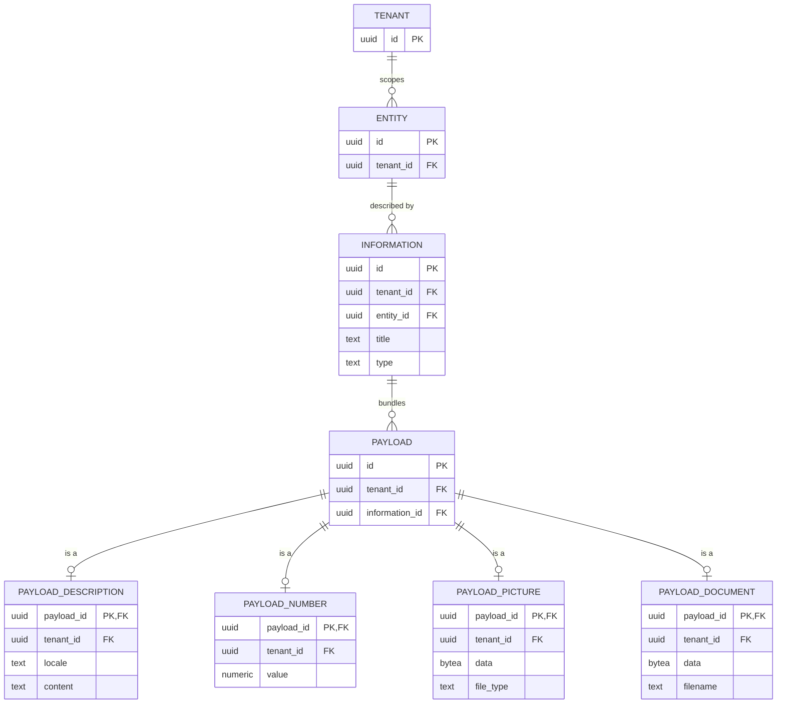

# ER diagram: information and payloads (sub-slice 6)

`payload` has no `kind` column, matching `entity`'s own class-table-inheritance pattern: which of the four concrete tables has a row with a given `payload_id` tells you what kind it is. Unlike `entity`, a payload should conceptually be exactly one kind - nothing enforces that yet. See [ADR 0017](../../adr/0017-information-and-payloads.md): `UNIQUE(entity_id, type)` on `information` isn't drawn here since mermaid's ER notation has no composite-unique-constraint marker distinct from the relationship lines above.
