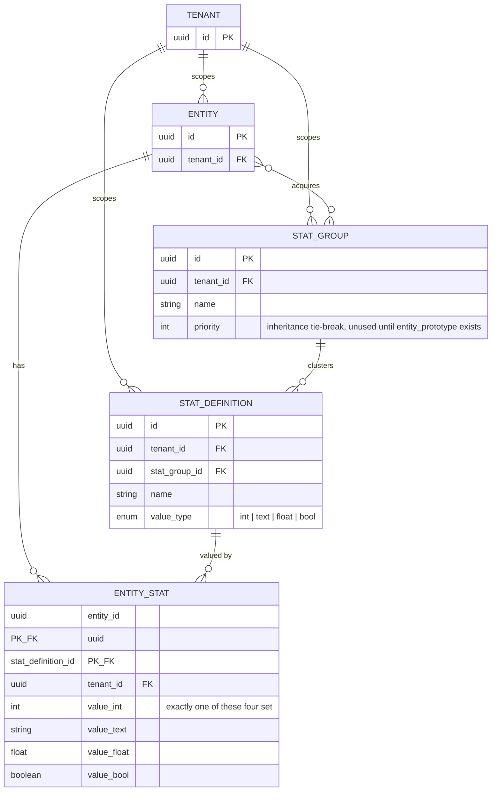

# ER diagram: stats (sub-slice 3)

`ENTITY }o--o{ STAT_GROUP` is the n:m relation — realized as `entity_stat_group(entity_id, stat_group_id)`, a pure join table with no attributes of its own, not shown as its own box here. See [ADR 0014](../../adr/0014-stats.md) — no resolution/inheritance walk yet, this is direct group membership and direct values only.
