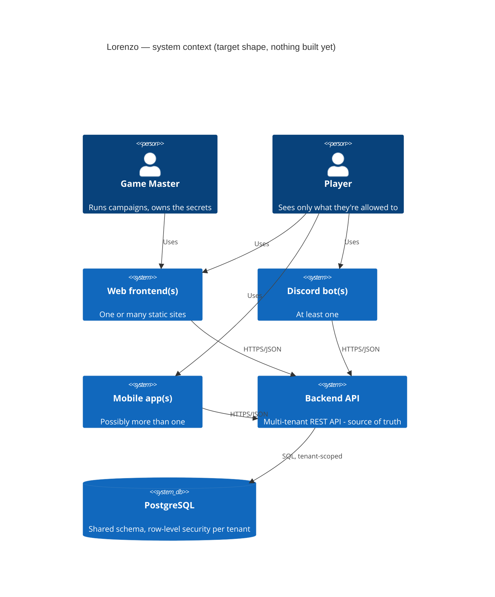

# System context

Every client (web, bot, mobile) is a narrower view onto the same API, and there can be more than one of each — see [ADR 0007](../adr/0007-apps-layout-and-multiplicity.md) and the [architecture overview](../overview.md).
