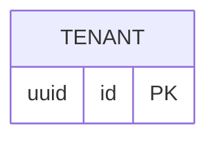

# ER diagram: tenant (bootstrap)

Deliberately minimal — see [ADR 0013](../../adr/0013-tenant-table-bootstrap.md). The full Tenant model (name, owner, and the rest of [ADR 0010](../../adr/0010-user-tenant-membership-model.md)) lands when the auth/users slice actually builds it; this just gives other tables (starting with `entity`, [ADR 0012](../../adr/0012-entity-table.md)) something real to reference.
