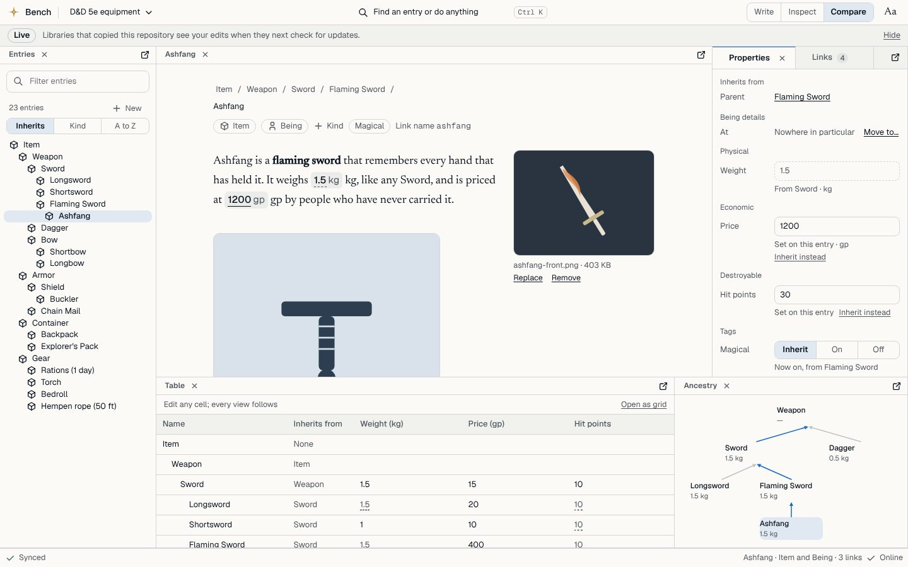

# Lorenzo Bench: design brief

What Bench looks and behaves like, as agreed with the maintainer on a clickable prototype. The decisions and the build order are in [RFC 0042](../../rfcs/0042-bench-workbench-interface.md); the app's architecture (offline, command layer, conflicts) is [RFC 0039](../../rfcs/0039-bench-authoring-offline-and-extensibility.md). This page is the picture.

The prototype is a Claude Design canvas, kept here as a source file: [`prototype/Main.dc.html`](prototype/Main.dc.html) with its notes in [`prototype/canvas.json`](prototype/canvas.json). It runs on made-up data and a pretend server; **it is a reference for behaviour and layout, not code to ship.** The real app is its own small TypeScript ([RFC 0039](../../rfcs/0039-bench-authoring-offline-and-extensibility.md) section 1). Screens are in [`screens/`](screens/).

Desktop first. The phone layout is deliberately deferred.

## The idea

Bench is a **workbench**, not a set of pages. An author has several things open at once (an item, a map, a timeline, a comparison) and arranges them the way they like. Everything is an entry in a repository; every view is a way of looking at entries and editing them through commands.

## The shell

- **Docking, Zed-style.** Panes hold tabs. A tab can be dragged to dock into an edge, to split a pane, or to float as a window ([floating](screens/02-floating-window.jpg)). Tabs are square; a pane with one tab shows a single title line instead of a tab strip.
- **Explorer** on the left lists the repository's entries by name (names first, [RFC 0039](../../rfcs/0039-bench-authoring-offline-and-extensibility.md)); **palette** jumps to anything.
- **Repository picker** in the title bar ([menu](screens/08-repository-menu.jpg)), a [start screen](screens/09-start-screen.jpg), a [first run](screens/10-first-run.jpg) that explains what the app is, and a [sign-out](screens/11-sign-out-with-changes.jpg) that says plainly what is still only on the device.
- **Honest state.** Each entry says "Saved on this device", "Waiting to sync" or "Synced". Derived values that could not be recomputed show "Out of date" rather than a guess. The LIVE banner says when an edit is seen at once by libraries using the repository.
- **Conflicts** are reviewed field by field, three ways: yours, theirs, the common base ([screen](screens/12-conflict-review.jpg)).

## Editing an entry

- **Several parents, kinds, bare entries.** An entry has any number of parents and any kinds; an entry with no stats is as valid as a monster ([parents](screens/13-several-parents.jpg), [kinds](screens/14-kinds-menu.jpg)).
- **Stats and formulas.** [Stats pane](screens/05-stats.jpg) tells own from inherited values; the [formula editor](screens/04-formula-editor.jpg) edits the vocabulary and formulas with a live check.
- **Text in LorenzoScript**, with entry links, hover previews and images (``), and an [image picker](screens/22-text-with-image-picker.jpg).
- **Pictures** ([screen](screens/06-pictures.jpg)): a main picture and a gallery per entry.
- **Compare grid** ([screen](screens/03-compare-grid.jpg)): entries as rows, stats as columns, edited in place.
- **Pack editor** ([screen](screens/07-pack-editor.jpg)): a structured editor for pack contents.

## The world, in views

All of these are views over the same entries, not separate data.

- **Map** ([screen](screens/15-map.jpg)): places on frames, level of detail by depth, region badges. Positions never inherit ([RFC 0026](../../rfcs/0026-world-model-axes-and-address.md)).
- **Relations** ([screen](screens/16-relations.jpg)): a social graph; connections are entries with two ends and a relation kind as parent; a toggle shows what they inherit.
- **Timeline** in three orders ([in order](screens/17-timeline-in-order.jpg)), a [calendar](screens/18-calendar.jpg) in the author's own format, and [what led to what](screens/19-what-led-to-what.jpg) ([RFC 0028](../../rfcs/0028-time-causality-and-calendars.md)).
- **Sheets from templates** ([NPC block](screens/20-sheet-from-template.jpg)): a template is an entry; a sheet is a view of an entry through it.
- **Manuscript** ([screen](screens/21-manuscript.jpg)): books and chapters as entries, read and written in order.

## What the prototype fakes

The server (revisions, versions, derived values), the clock, the pictures, the map tiles, and everything about offline: no IndexedDB, no service worker, no real conflicts. It invents the shapes the API slices of [RFC 0041](../../rfcs/0041-entity-kinds-and-author-freedom.md) are meant to provide.

## Regenerating the screens

The canvas runs in any browser given the design runtime (`support.js`, not kept here). The screens were rendered at 1440x900 with Playwright. They are illustrations; if the prototype and a screen disagree, the prototype wins, and if either disagrees with a decided RFC, the RFC wins.
